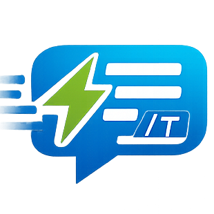

<div align="center">



# QuickText

A lightweight and powerful browser extension that replaces short triggers and hotkeys with longer, predefined text snippets.

</div>

---

## Demo

<div align="center">

[](docs/quicktext.webm)

</div>

---

## Tech Stack

<p align="center">
  
  
  
  
  
</p>

---

## Features

- **Text Triggers**: Create snippets that expand when you type a specific trigger (e.g., typing `/sig` expands to your full email signature).
- **Hotkey Triggers**: Assign global keyboard shortcuts (e.g., `Ctrl+Shift+1`) to your most-used snippets for instant expansion.
- **Rich Text Support**: Create snippets with formatting like bold, italics, links, and more, which will be rendered correctly in rich text editors (like Gmail, Google Docs).
- **Simple Management**: An intuitive options page to add, edit, and delete your snippets.
- **Import & Export**: Easily back up your snippets to a JSON file or import them to a new browser or computer.
- **Cross-Browser Compatibility**: Works seamlessly on both Chrome (and other Chromium browsers) and Firefox.

---

## Project Structure

The repository is organized to support multiple browser targets from a single codebase.

```
QuickText/
├── Chromium/
│   ├── background.js       # Service worker for Chrome
│   ├── content_script.js   # Injects into web pages
│   ├── options.html        # Options page UI
│   ├── options.js          # Options page logic
│   ├── manifest.json       # Extension manifest for Chrome (V3)
│   └── images/             # Icons for Chrome
│
├── Mozilla/
│   ├── background.js       # Background script for Firefox
│   ├── content_script.js   # Injects into web pages
│   ├── options.html        # Options page UI
│   ├── options.js          # Options page logic
│   ├── manifest.json       # Extension manifest for Firefox
│   └── images/             # Icons for Firefox
│
└── README.md               # You are here!
```

---

## Setup and Installation

### For Chrome & Chromium Browsers

1. Clone this repository to your local machine.
2. Open Chrome and navigate to `chrome://extensions`.
3. Enable **Developer mode** using the toggle in the top-right corner.
4. Click the **Load unpacked** button.
5. Select the `QuickText/Chromium` folder from the cloned repository.
6. The QuickText icon will appear in your browser's toolbar.

### For Firefox

1. Clone this repository to your local machine.
2. Open Firefox and navigate to `about:debugging`.
3. Click on **This Firefox** in the sidebar.
4. Click the **Load Temporary Add-on...** button.
5. Navigate into the `QuickText/Mozilla` folder and select the `manifest.json` file.
6. The QuickText icon will appear in your browser's toolbar.

**Or download from Mozilla Add-ons:** [https://addons.mozilla.org/en-US/firefox/addon/gxquicktext/](https://addons.mozilla.org/en-US/firefox/addon/gxquicktext/)

---

## How to Use

1. **Open the Options Page**: Click the QuickText icon in your browser's toolbar to open the options page.

2. **Create a Snippet**:
   - **Trigger**:
     - For a **text trigger**, enter a keyword that starts with a `/` (e.g., `/hello`).
     - For a **hotkey trigger**, enter a key combination (e.g., `Ctrl+Shift+H`). Modifiers (`Ctrl`, `Alt`, `Shift`, `Meta`) are supported.
   - **Expansion Value**:
     - Enter the text you want the trigger to expand into.
     - For the Chromium version, you can toggle the **Rich Text** editor to add formatting.
   - Click **Add Snippet**.

3. **Trigger a Snippet**:
   - Go to any text field on any website (a textarea, an input box, a rich text editor).
   - **For text triggers**: Type your trigger (e.g., `/hello`) and it will automatically be replaced with the expansion value.
   - **For hotkey triggers**: Press the key combination you defined (e.g., `Ctrl+Shift+H`) and the expansion value will be inserted at your cursor's position.

4. **Manage Snippets**:
   - Use the **Edit** and **Delete** buttons in the snippet list on the options page to manage your snippets.
   - Use the **Export** button to save all your snippets to a `.json` file.
   - Use the **Import** button to load snippets from a previously exported file.

---

## Contributing

Contributions are welcome! If you have ideas for new features, bug fixes, or improvements, please feel free to:

1. Fork the repository.
2. Create a new branch (`git checkout -b feature/YourAmazingFeature`).
3. Commit your changes (`git commit -m 'Add some AmazingFeature'`).
4. Push to the branch (`git push origin feature/YourAmazingFeature`).
5. Open a Pull Request.

---

## License

<p align="center">
  
</p>

This project is open-source and available under the MIT License.
